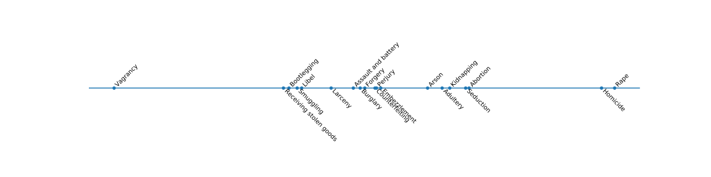

# Crime comparisons dataset

This repository provides the data used in Louis L. Thurstone's seminal 1927
paper, "The Method of Paired Comparisons for Social Values" ([link to
paywall][1] or [open-access HTML version][2]) in machine-readable format.

Thurstone's study aimed at showing that [pairwise-comparison models][3] could
be used to investigate interesting questions beyond psychophysics. To that end,
he set out to create a "crowdsourced" scale of the seriousness of criminal
offences by asking 266 students questions of the type:

> Which crime is worse: *A* or *B* ?

where *A* and *B* are chosen among a list of 19 criminal offenses.
Using his "Case V" model of pairwise-comparison outcomes (see [this excellent
tutorial][4] for more information), he was able to produce a scale that looks
roughly as follows.

## How to analyze the data

If you are using Python, I recommend that you try out [choix][5], a library
that I've developed to learn models based on comparion data. You can see an
example in [this notebook][6].

## Errors in the original data

The contents of `ccdata-original.csv` faithfully reproduce the data in Table 1
of Thurstone's paper (page 399). However, upon close investigation, it seems
that there are a number of small mistakes and typos in this table.

- "Assault and Battery" vs. "Adultery": ratios sum only to 0.999
- "Assault and Battery" vs. "Homicide": ratios sum to 0.100
- "Arson" vs. "Homicide": ratios sum to 0.100
- "Arson" vs. "Libel: ratios sum to 0.999
- "Perjury" vs. "Counterfeiting": ratios sum to 0.999

I decided to fix those (according to _my own subjective interpretation_ of what
should have been there), and the result is given in `ccdata-fixed.csv`.

The labels of the crimes corresponding to the rows and columns of the table are
provided in `labels.txt`.

[1]: http://dx.doi.org/10.1037/h0065439
[2]: https://brocku.ca/MeadProject/Thurstone/Thurstone_1927a.html
[3]: https://en.wikipedia.org/wiki/Pairwise_comparison
[4]: http://mayagupta.org/publications/PairedComparisonTutorialTsukidaGupta.pdf
[5]: https://github.com/lucasmaystre/choix
[6]: notebooks/compute-scale.ipynb
